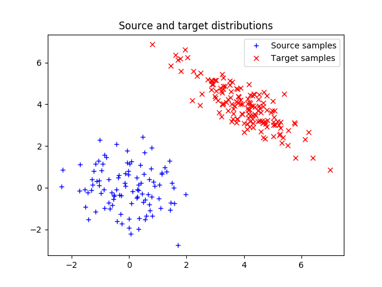

# TF-OT-Sinkhorn
Tensorflow implementation of optimal transport (OT) with Sinkhorn algorithm. This code is essentially the Tensorflow reimplementation of the Sinkhorn algorithm in the common used Python OT library ([https://github.com/rflamary/POT](https://github.com/rflamary/POT)) and the PyTorch OT ([https://github.com/rythei/PyTorchOT](https://github.com/rythei/PyTorchOT)) project.

## Usage

This code can be used:
 - To calculate the optimal transport distance with Tensorflow.
 - To integrate optimal transport as a loss function during training in a differentiable way.

## Example

```
from ot_tf import dmat, sink

M = dmat(x, y)
tf_sinkhorn_loss = sink(M, (na, nb), reg)
```

For complete example, please refer to [example.py](./example.py).

*PS.* For convenience, the data generation operation is borrowed from the [POT](https://github.com/rflamary/POT) library. Please refer to this library for installation. In the provided example, the comparison of the results between [POT](https://github.com/rflamary/POT) and our Tensorflow reimplementation is also provided.


